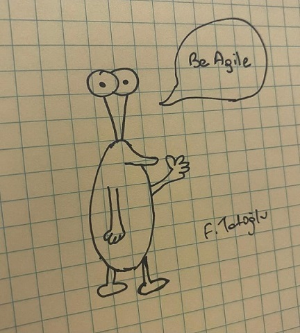

# Blog Yazmak

Fikirlerimi, ürünlerimi, projelerimi ve bilgilerimi paylaşmak, fiziksel olarak gerçekleştirdiğim arzularımdan biri ama bunu internette sürdüremedim. Bu nedenle, blog yazmaya nasıl başladığıma dair birçok hikayem var. Her seferinde heyecanla başladım. Ama beş altı makaleden sonra artık yazmak için motivasyonum kalmamıştı.

Bu durumu eşimle konuştuğum zaman, *"Bir şeye başlamayı seviyorsun ama devam etmiyorsun"* dedi. Motivasyon eksikliğimin asıl nedenini anlamaya çalışırken 2020 yılında bir toplantıya katıldım. Türkiye'nin en ünlü karikatüristlerinden [Selçuk Erdem](https://twitter.com/selcukerdem "Selçuk Erdem (@selcukerdem) / Twitter"), toplantıda şunları söyledi: *"Bir şey yapmamak için çok fazla içsel mazeret var. Örneğin, renkli ve pahalı defterler veya kalemler. Yazarken veya çizerken sizi yargılarlar. En ucuz ve en etkileyici olmayanları seçin"*. Toplantıda söylenenlerden sonra eski girişimlerimin de benzer adımların olduğunu fark ettim. Rutini kırmam ve blog için yeni şeyler denemem gerekiyordu.

Öncelikle blog yazma amacımı tanımlamam gerektiğini düşündüm. Amacım yeni şeyler öğrenmek, başkalarıyla paylaşmak ve yazılarımdan keyif almak. Daha sonra motivasyonumu artırmak için bu yazıyı yazdım. Motivasyonumu kaybedersem tekrar bulmak için bu makaleyi okumayı planlıyorum. Ayrıca doğru yönlendirme ile neler yapabileceğimi görünür kılmak için, [Selçuk Erdem](https://twitter.com/selcukerdem "Selçuk Erdem (@selcukerdem) / Twitter")'in verdiği talimatla hiç çizim yeteneğim olmadan çizdiğim bir resmi de ekledim.

Blog yazma konusunda beni cesaretlendirdikleri için eşime ve [Selçuk Erdem](https://twitter.com/selcukerdem "Selçuk Erdem (@selcukerdem) / Twitter")'e teşekkür ederim.
