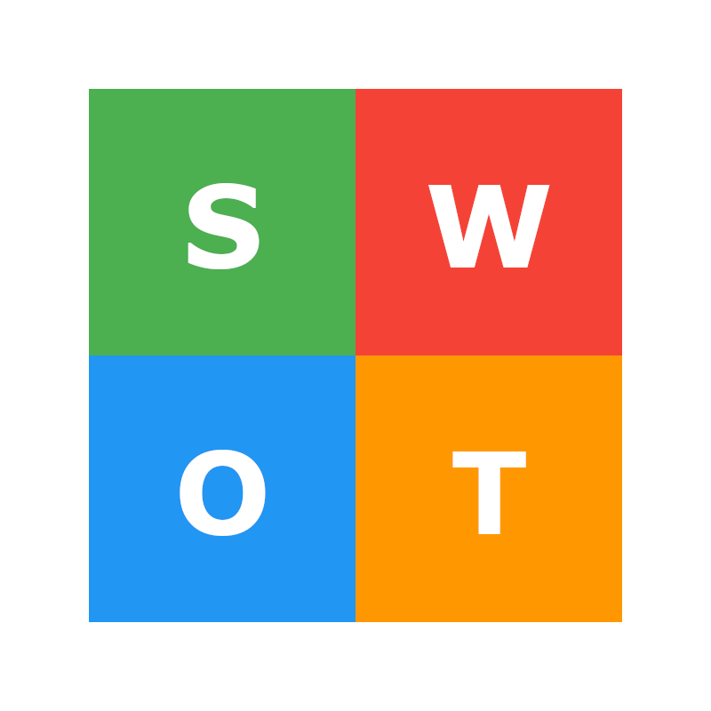
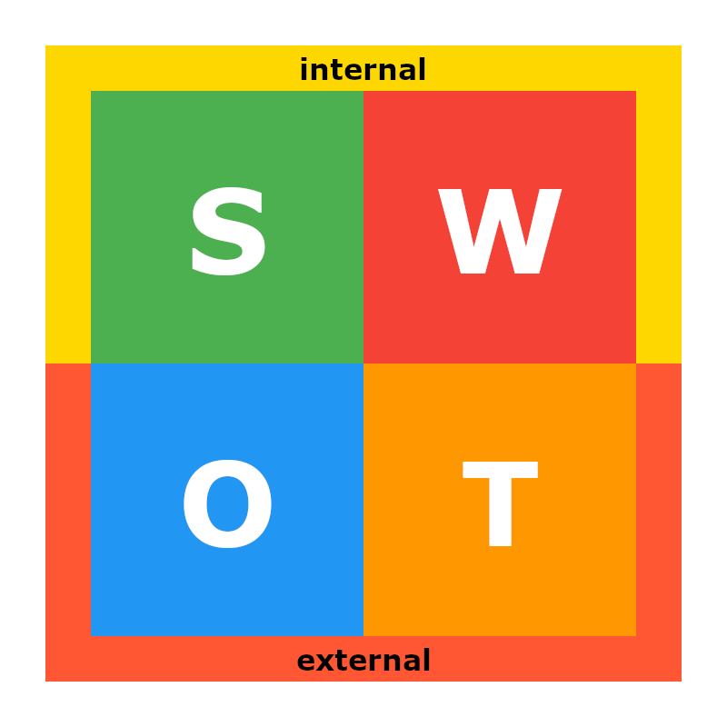
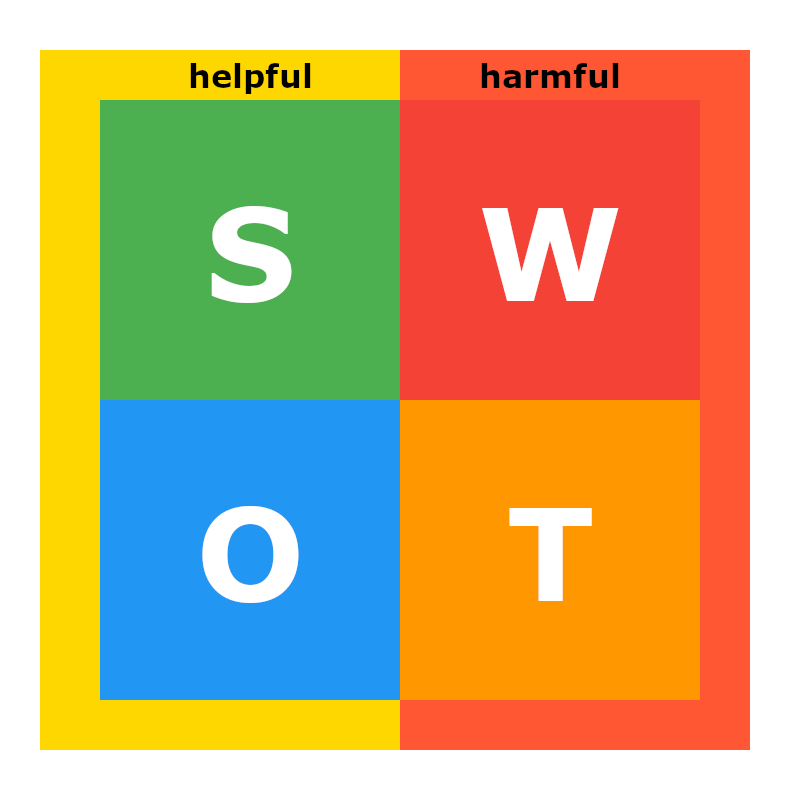

SWOT analysis is a crucial tool that shows the current situation of a company or organization. Everyone knows how is important to know this before making any strategic move. Therefore, I think it is a method that everyone should learn.

SWOT analysis makes visible not only the environmental interaction but also the effects of the internal dynamics of the company or organization.

The power of the SWOT analysis is that it is simple to apply. Answering some questions sincerely and note it. That's enough to complete a SWOT analysis.

This technique focuses on four fundamental concepts.

- Strengths
- Weaknesses
- Opportunities
- Threats

## Strengths

This concept refers to what a company or organization has, knows, or experiences. For example, Apple

- Has a strong brand recognition
- Knows to combine innovation and technology
- Has a robust global distribution network

With those items, Apple can move forward more safely in the market.

## Weaknesses

Like strengths, every company and organization has weaknesses, too. Weaknesses refer to what a company or organization doesn't have, know, or experience yet.

In my opinion, this concept is the second level risky part of the SWOT analysis.

## Opportunities & Threats

I'd love to explain these concepts together. Both of them are related to a company's or organization's external interaction with its environment. To calculate the potential of a company or organization, everyone wants to know these to see the future or guess the next strategic move. For example, Apple again.

Opportunities

- Emerging markets (China, India)
- Growing demand for mobile technology
- Expansion of subscription-based services

Threats

- Intense competition (Samsung, Huawei, etc.)
- Changing consumer demands
- Intellectual property violations
- Supply chain disruptions

I need to give a break before explaining more about SWOT. SWOT analysis is a powerful technique. However, it is not a silver bullet. It only makes the current situation visible. Not adding any comments or reviews on it is fatal. After knowing the current situation, it must be interpreted by different techniques to make a strategic move.

## Evaluation

There are two common steps in the evaluation phase of the SWOT. The first one is grouping, and the other one is interpretation. The grouping step helps to recognize the situation before interpreting but the interpretation step is essential for a useful SWOT.

### Grouping

So far, I've known there was only one grouping style for SWOT. However, I've learned a new one.

#### Internal & External Factor Grouping

In this grouping, the strengths and weaknesses are in the internal group. So, opportunities and threats are in the external group. This grouping comes from the definition of the SWOT concepts and it is the usual grouping style.

#### Helpful & Harmful Factor Grouping

I've learned this style recently and liked it because it creates an awareness of the pain points of a company or organization. From my experience, many people just focus on strengths and threats while interpreting the SWOT. Maybe some of them also focus on opportunities.

In this grouping style, weaknesses and threats are in the harmful group. Strengths and opportunities are in the helpful group. The harmful group may show the pains and the helpful group may show the sustainable survival.

### Interpret

This step is critical for me because misunderstanding or wrong interpretation would be a problem for a company or organization. For example, Blackberry or Nokia.

I don't want to tell the story and I guess you know it. But the lesson is crystal clear and summarized with one quote from William Pollard.

> To change is difficult. Not to change is fatal.

## Challenges

SWOT analysis is simple to apply but there are also some challenges during the application. The first challenge is communication and collaboration. Making a SWOT analysis, joining different people from different departments and titles is important to represent the company or organization to have more comprehensive and balanced results. In addition, different perspectives may create creativity.

The second challenge is realism. It is important to objectively assess weaknesses and threats. Unrealistic or overly optimistic evaluations can affect the success of the strategy. One of the managers from my old company said, "Never hide it, it will bite". I want to use this here. At the end of the day, hidden pains or threats will appear suddenly and the company or organization may not be ready or have enough capacity, to handle them.

The last challenge is sustainability. SWOT analysis should be a repetitive process, not a single moment in time. The environment and internal dynamics of the company or organization may change over time, so the analysis should be reviewed regularly.
