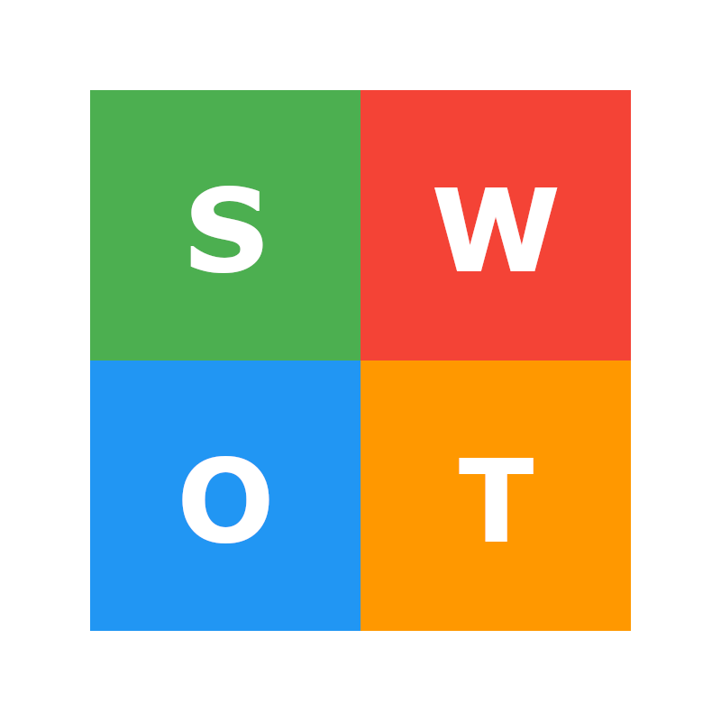
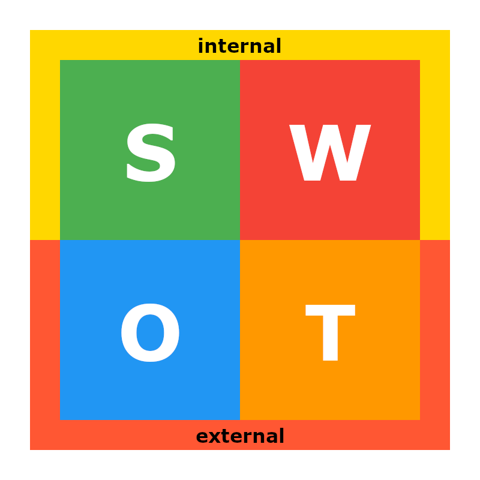

SWOT analizi, bir şirketin veya kuruluşun mevcut durumunu gösteren önemli bir araçtır. Herhangi bir stratejik hamle yapmadan önce bunu bilmenin ne kadar önemli olduğunu herkes bilir. Bu nedenle herkesin öğrenmesi gereken bir yöntem olduğunu düşünüyorum.

SWOT analizi sadece çevresel etkileşimi değil aynı zamanda şirket veya organizasyonun iç dinamiklerinin etkilerini de görünür hale getirir.

SWOT analizinin gücü, uygulamasının basit olmasıdır. Bazı soruları içtenlikle cevaplayıp not edin. Bu bir SWOT analizini tamamlamak için yeterlidir.

Bu teknik dört temel kavrama odaklanmaktadır.

- Güçlü
- Zayıf yönler
- Fırsatlar
- Tehditler

## Güçlü

Bu kavram, bir şirketin veya kuruluşun sahip olduğu, bildiği veya deneyimlediği şeyleri ifade eder. Örneğin, Apple

- Güçlü bir marka bilinirliğine sahiptir
- Yenilik ve teknolojiyi birleştirmeyi bilen
- Güçlü bir küresel dağıtım ağına sahiptir

Apple bu ürünlerle pazarda daha güvenli bir şekilde ilerleyebilir.

## Zayıf yönler

Güçlü yönler gibi, her şirket ve organizasyonun da zayıf yönleri vardır. Zayıf yönler, bir şirketin veya kuruluşun henüz sahip olmadığı, bilmediği veya deneyimlemediği şeyleri ifade eder.

Bana göre bu kavram SWOT analizinin ikinci düzey riskli kısmıdır. Neden? Daha detaylı açıklayacağım (biraz merak).

## Fırsatlar / Tehditler

Bu kavramları bir arada açıklamayı çok isterim. Her ikisi de bir şirketin veya kuruluşun çevresiyle olan dış etkileşimiyle ilgilidir. Bir şirketin veya kuruluşun potansiyelini hesaplamak için herkes geleceği görmek veya bir sonraki stratejik hamleyi tahmin etmek için bunları bilmek ister. Mesela yine Apple.

Fırsatlar

- Gelişmekte olan pazarlar (Çin, Hindistan)
- Mobil teknolojiye yönelik artan talep
- Aboneliğe dayalı hizmetlerin genişletilmesi

Tehditler

- Yoğun rekabet (Samsung, Huawei vb.)
- Değişen tüketici talepleri
- Fikri mülkiyet ihlalleri
- Tedarik zinciri kesintileri

SWOT hakkında daha fazla açıklama yapmadan önce biraz ara vermem gerekiyor. SWOT analizi güçlü bir tekniktir. Ancak bu sihirli bir değnek değil. Sadece mevcut durumu görünür kılar. Üzerine herhangi bir yorum veya değerlendirme eklememek ölümcüldür. Mevcut durumu öğrendikten sonra stratejik hamle yapabilmek için farklı tekniklerle yorumlanması gerekir.

## Değerlendirme

SWOT değerlendirme aşamasında iki ortak adım vardır. Birincisi gruplama, diğeri yorumlamadır. Gruplandırma adımı, yorumlamadan önce durumun farkına varılmasına yardımcı olur ancak yorumlama adımı, yararlı bir SWOT için esastır.

### Gruplama

Şu ana kadar SWOT için tek bir gruplandırma stili olduğunu biliyordum. Ancak yeni bir tane daha öğrendim.

#### İç ve Dış Faktör Gruplaması

Bu gruplamada güçlü ve zayıf yönler iç gruptadır. Yani fırsatlar ve tehditler dış gruptadır. Bu gruplandırma SWOT kavramlarının tanımından gelmektedir ve olağan gruplama stilidir.

#### Yararlı ve Zararlı Faktör Gruplaması

Bu tarzı yakın zamanda öğrendim ve beğendim çünkü bir şirketin veya organizasyonun sıkıntılı noktalarına dair farkındalık yaratıyor. Deneyimlerime göre birçok kişi SWOT'u yorumlarken sadece güçlü yönlere ve tehditlere odaklanıyor. Belki bazıları fırsatlara da odaklanıyor.

Bu gruplandırma tarzında zayıf yönler ve tehditler zararlı grupta yer alır. Güçlü yönler ve fırsatlar yararlı gruptadır. Zararlı grup acıları gösterebilir, yardımsever grup ise sürdürülebilir hayatta kalmayı gösterebilir.

### Yorumlamak

Bu adım benim için kritik çünkü yanlış anlama veya yanlış yorumlama şirket veya kuruluş için sorun olabilir. Örneğin Blackberry veya Nokia.

Hikayeyi anlatmak istemiyorum ve sanırım bunu biliyorsun. Ancak ders çok net ve William Pollard'dan bir alıntıyla özetleniyor.

> Değişmek zordur. Değişmemek ölümcüldür.

## Zorluklar

SWOT analizinin uygulanması basittir ancak uygulama sırasında bazı zorluklar da vardır. İlk zorluk iletişim ve işbirliğidir. SWOT analizi yapmak, farklı departman ve unvanlardan farklı kişileri bir araya getirmek, firmayı veya kurumu temsil etmek, daha kapsamlı ve dengeli sonuçlara ulaşmak açısından önemlidir. Ayrıca farklı bakış açıları yaratıcılık yaratabilir.

İkinci zorluk gerçekçiliktir. Zayıf yönleri ve tehditleri objektif olarak değerlendirmek önemlidir. Gerçekçi olmayan veya aşırı iyimser değerlendirmeler stratejinin başarısını etkileyebilir. Eski şirketimin yöneticilerinden biri "Asla saklamayın, ısırır" dedi. Bunu burada kullanmak istiyorum. Günün sonunda gizli acılar veya tehditler aniden ortaya çıkacak ve şirket veya kuruluş bunlarla baş etmeye hazır veya yeterli kapasiteye sahip olmayabilir.

Son zorluk sürdürülebilirliktir. SWOT analizi tek bir an değil tekrarlanan bir süreç olmalıdır. Şirketin veya kuruluşun ortamı ve iç dinamikleri zamanla değişebileceğinden analizin düzenli olarak gözden geçirilmesi gerekir.
