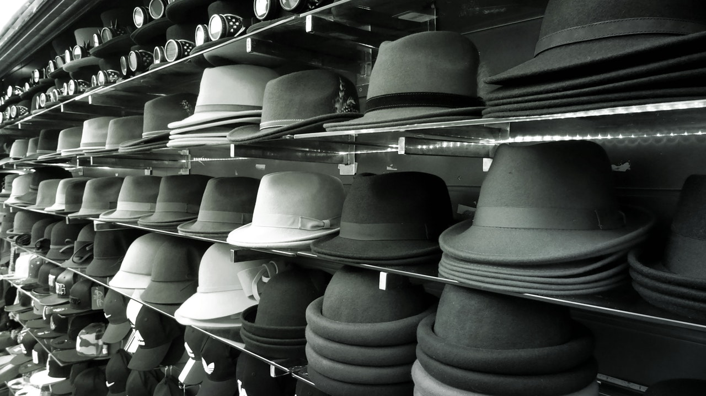

# Roller ve Şapkalar

Scrum Master'lık yaparken ve sonrasında eğitim alırken bir Scrum Master'ın sahip olması gereken yetkinlikleri öğrenmiştim. Kolaylaştırıcı, Değişim Ajanı, Engel Kaldırıcı vb. gibi roller. Daha sonrasında yönetici eğitimi alıyorken benzer rol yapısının yönetici tarafında da olması gerektiğini gördüm.

Çalışma hayatında bu rollerin hepsini veya bir kısmını mutlaka görüyor olacaksınız. Hatta bu rollerden bazılarını üstlenmeniz bile gerekecek. Ama hiç korkacak bir şey yok. Bu rollerin hepsi sonradan öğrenilebiliyor. Hatta bu rollerle ilgili yapılması gerekenler ve yapılmaması gerekenleri anlatan çok fazla da kitap var. Bu yazı o bilgi kaynaklarından biri olur mu takdiri size bırakıyorum.  

## Şapkalar

Ben rolleri şapkalara benzetiyorum. Şapka seçerken size uygun olanı seçersiniz. Eğer size uygun değilse hem çok güzel durmaz hem de rahatsızlık verecektir. Ancak bu sefer şapkaların hepsi size uygun ve çok güzel duruyor. Sadece hangisini nerede giyeceğinize karar vermeniz gerekiyor.

Hadi o zaman elimizdeki şapkaları ve o şapkaların simgelediği rollere bir göz atalım.

### Eğitmen

Eğitim almak isteyen kişilere istenilen konuyu anlatan kişidir. Eğitmenlerin sorumluluğu eğitimden sonra bitmektedir. Yani eğitim alan öğrencilerin öğrendiklerini uygulayıp uygulamadığla ilgilenmemektedir. Ama doğru anlaşıldığını teyit etmek için test veya ödev gibi araçları kullanabilir.

Eğitmen, anlatacağı veya aktaracağı konu ile ilgili doküman, sunum veya belgeleri kendi hazırlar. Bu dokümanlar yapılan araştırmlar ve tecrübelerin bir araya gelmesi ile oluşturulmaktadır.

Eğitmen tek bir kişi yerine birden fazla kişiye bilgi aktarmaktadır.

### Danışman

Bir alanda yaptığı çalışmalarla ve kazandığı tecrübelerle uzmanlaşan ve ihtiyaç halinde danışılan kişilerdir. Danışmanlar tecrübelerini baz alarak karşılaşılan problemlerde danışanlara destek olmaktadır.

Danışmanlar destek oldukları konunun danışanların istediği şekilde sonuçlandığından emin olmak isterler.

### Koç

Koç sizin kendiniz için belirlediğiniz hedefe doğru ilerlerken; içinizdeki postansiyeli ortaya çıkartmanızda ve farkındalık seviyenizi arttırmanızda size destek olmaktadır. Destek olurken önceki tecrübeleri veya uzmanlıklarını kullanmak yerine size özel bir çalışma ve destek programı belirlemektedir.

Koçların en önemli özelliği iyi dinlemek, sorular sorarak tam olarak ihtiyaçlarınızı anlamak ve bu ihtiyaçlara sizin çözümler bulmanız için sizde farkındalık yaratmaktır.

### Mentor

Mentor bence günümüzde yönetici olmasak bile en çok yaptığımız rollerden bir tanesi. Mentor; kazandığı deneyim, bilgi bikirimi veya uzmanlığı ile kişilere yol gösteren, tavsiyeler veren, hedef belirleyen ve bu hedefe giderken kişilerle birlikte yürüyen kişilerdir.

Mentor daha çok tecrübelerini baz alarak ilerleyen bir roldür. Bu yüzden bireysel çalışma yapılıyor olsa da aynı hedefi başka kişiler içinde ilerletiyor olabilir.

### Kolaylaştırıcı

Kolaylaştırıcı danışanın hedefine daha kolay ulaşmasını sağlayan kişidir. Danışanın kolayca hedefine ulaşması için yapılması gereken adımları da atabileceği gibi sadece hızlı yolları da gösteren kişi de olabilir.

Danışan ile birlikte çalışmak zorunda değildir. Ayrı olarak gözlem yapıp aksiyonlarını bağımsız olarak alabilmektedir.

### Engel Kaldırıcı

Danışanın hedefe ilerlemesi sırasında önüne çıkabilecek engelleri önceden görüp, bunların kaldırılmasını sağlayan kişidir. Engelleri kaldırıyorken iletişim veya insan ilişkilerini kullanırlar.

Danışanların bir aksiyon almasına gerek kalmadan engeller ortadan kaldırılmış olmaktadır.

### Yönetici

Bir sürecin ya da ekibin yönetilmesi için gereken yönetim gücünü elinde bulunduran kişidir. Sürecin ya da ekibin çalışmasını ve kurum ile paralel hedeflere ulaşmasını sağlamak için karar alan ve bazen de risk alan kişidir.

Yönetici bilgi birikimi ve tecrübesinin yanında iletişim ve insan ilişkilerinde çok iyi olmalıdır. Yönettiği kişileri periyodik olarak denetler ve duruma göre aksiyon alınmasını sağlar veya aksiyon alır.

### Dinleyici

Dinleyici aslında tam bir rol değil gibi gelebilir ancak şu sahneyi yaşamış olabilirsiniz. Çok kötü bir durumunu içindesiniz ve sadece biri ile bu duygunuzu paylaşmak istiyorsunuz. Karşınızdaki size hiç bir şey söylemiyor ve sadece dinliyor. Size dinlediğini de gösteriyor ancak sonunda bir aksiyon almıyor ya da sizi bir aksiyon için yönlendirmiyor. Bu role ben dinleyici diyorum.

Şirketlerde veya çalışma hayatında mutlaka olması gereken bir rol olduğunu düşünüyorum.

Sizinde çalışma hayatınızda gözlemlediğinizi farklı roller veya şapkalar olacaktır. Bunları da iletişim ekranından benimle paylaşabilirsiniz.

## Şapkaları Nasıl Giymeli

Çalışma hayatında rollerin ve sorumlulukların her zaman iç içe geçtiğini gördüm. Bu yüzden yöneticilik ya da mentorlük yaparken aslında koçluk veya eğitmenlik yaptığım da oldu. Yani aynı anda birden fazla şapka giymem gerekti. Fakat bazı zamanlarda da sadece tek bir şapka ile ilerleyebildim.

Yoğun zamanlarda çok fazla şapkayı aynı anda giymeniz gerekecek. Bu durumda sorumluluklar üst üste binecektir. Burada çözüm bir denge veya sıralama oluşturmak olabilir. **Koç** olarak konuları derinleştirip, ihtiyacın anlaşılmasına olanak verdikten sonra danışanın ihtiyacına göre diğer şapkalara geçiş yapılabilir.

Her rolün kullanması gereken teknikler ve bilgi birikimleri farklıdır. **Koç** yolunuzu bulmanızda sizi yönlendirirken, **Mentor** size destek olarak yolda birlikte yürümenizi sağlayacaktır. **Danışman** hızlıca probleminizi çözerken, **Eğitmen** size yeni bir bilgi aktarmaya çalışacaktır.

## Danışan Etkisi

Rolümüze girdik, şapkamızı taktık ama burada unutulmaması gereken diğer bir aktör ise danışandır. Danışan olmadan kendi kendinize istediğiniz rolü sahiplenebilirsiniz. Fakat bir anlam ifade etmeyecektir.

Taktığımız veya takacağımız bu şapkalar aslında bir ihtiyaçtan ortaya çıkıyor. Danışan kişi veya kişilerin ihtiyaçları... Bu yüzden bu şapkaları takarken bizim ne yapmak veya hangi şapkayı takmak istemimizden çok danışannın ihtiyacının ne olduğu çok daha önemli. Hatalı bir şapkanın etkisi, öngörülemeyen motivasyon kayıplarına, duygu değişimlerine ya da hatalı iş yapılmasına sebep olabilir. Tam olarak kaş yapayım derken göz çıkartmış olmamak için danışanın ihtiyacının iyi anlaşılması gerekmektedir.

Gün sonunda hangi şapkayı takıyor olduğunuzun çok bir önemi olmuyor. Gelecek olan geri bildirimler, danışanlarınıza ne kadar destek olduğunuz veya onları ne kadar mutlu ettiğiniz ile doğru orantılı olacaktır. Bu da sizin çalışma hayatınızdaki başarınız olarak yorumlanacaktır. Bu yüzden size en çok yakışan şapka yerine, karşınızdaki kişinin ihtiyacı olan şapkayı takmaya özen gösterin.

## Referanslar

1. [Yazının Fotoğrafı](https://www.pexels.com/tr-tr/fotograf/rafta-karisik-renkli-kapak-lotu-396777/ "Yazının Fotoğrafı")
