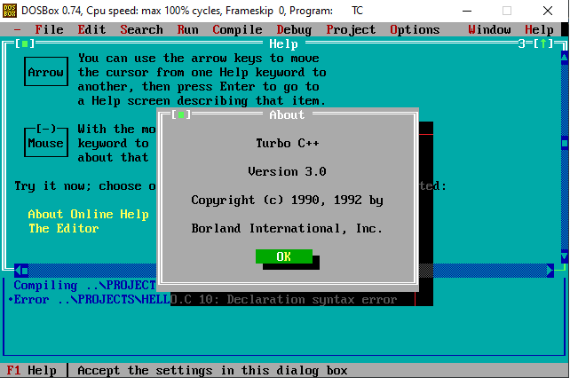

# Turbo C Teması

Küçükken en büyük eğlencem, bilgisayar dergilerini okumak ve onlardan çıkan CD lerdeki demo oyunları oynamaktı. Bir gün dergilerden bir tanesinin yanında ufak bir el kitapçığı buldum **C ile Programlama**. Kitapçık içinde basit bir şekilde C programlama dili anlatılıyordu. Kitapçığı bir çırpıda okudum ve denemek istiyordum. Turbo C adında bir program olduğunu ve bunun ile örnek yapabileceğim yazılıyordu ama program hiç bir yerde yoktu. İnternette dolaşırken buldum. Kendilerini hacker olarak tanıtan bir ekibin hazırladığı notların da olduğu bir zip dosyasını indirdim. İçinde Turbo C de vardı. Önce notları okudum ve sonrasında denemeler yapmaya başladım.

Bir kitapçık sayesinde programlamaya başlamam lise yıllarına denk geliyor. Programlamaya başladıktan sonra da ayrılamadım.

[Blog Yazmak][1] yazısında da bahsettiğim gibi blog yazmak çok eğlenceli ama ben daha çok başlamayı yapabiliyorum. 2021 sonlarında yine blog yazmak istediğim zaman sitemin temasını çok beğenmedim. Yeni tema; hem sade hem de biraz nerd işi olmalıydı. Bu istediğim özelliklerde bir şey de bulamadım. En sonunda kendim bir şeyler yapayım dedim ama öyle hazır bir şeyler kullanmak yerine ellerimi biraz kirletmek istedim.

Hem Turbo C ile olan duygusal bağımı yansıtacak, hem yeni şeyler öğrenebileceğim bir tema yazmak istedim. Şu anda bu sitede de gördüğünüz tema ortaya çıktı. Ancak önemli olan nokta bunu yaparken neler kazandığım.

## Zorluklar ve Kazanımlar

Ben senelerce ön yüzü olmayan uygulamalar geliştirdim. Çok nadir olarak ön yüzü olan ve genelde de şirket içinde kullanılan uygulamalar geliştirdim. Bu yüzden önyüz teknolojilerine çok hakim değilim. Bu fırsat ile bunları deneme şansım oldu.

| Teknolojiler |
|-|
|       |

### SASS

Daha önce duyduğum ama hiç kullanma fırsatım olmayan bir yapıydı. Kullanınca ne kadar kolay ve basit olduğunu gördüm. Yeniden bir önyüz işine girsem mutlaka kullanmam gerektiğini düşünüyorum. Başta `function` ve `mixin` arasında biraz karışıklık yaşadım. Sonra örneklerden de bakarak aslında çok zor olmadığını farkkettim. `function` bir değer dönüyor. `mixin` ise bir kod parçasını çağrıldığı alana ekliyor. Bu sayede tekrar kullanılabilir bir parça elde etmiş olunuyor.

### Normalize.css

Önyüz geliştirmesi yapan arkadaşlarıma en çok sorduğum sorulardan bir tanesi ***"Reset.css mi yoksa Normalize.css mi?"*** Cevapları genelde [normalize.css][4] şeklinde oluyor. Kararsız kaldığım için biraz daha araştırma yaptım. Gözüme **Elad Shechter**'ın yazdığı [Normalize CSS or CSS Reset?!][3] yazı takıldı. Okuduktan sonra ikisini de bir arada kullanmanın daha iyi olduğunu düşündüm.

Yazıda anlatılan ve özetle yapılan yaşlaşım; [normalize.css][4] ile sitil dosyaları bir seviyede eşitliyor. İhtiyaç olan sıfırlama işlemleri de sonrasına ekliyor. Bu sayede istenilen esnekliğe kavuşulmuş olunuyor.

### Gulp & NodeJS

Önyüz projesi geliştirirken her zaman tercihim [nodejs][6] kullanmak şeklinde oluyor. [nodejs][6] sayesinde paket yönetimini çok rahat yapılabiliyor. Ama bu sefer biraz daha kompleks işler yapacağımı düşünerek [gulp][7] eklemek istedim.

[gulp][7] hem önyüz projeleri hem de basit otomasyon işleri için kullanılan bir araç. Başka otomasyon araçları da olmasına karşın ilk öğrendiğim otomasyon aracı olduğu için kullanmak istedim.

### Mustache

Tasarımları yaptıktan sonra bunları bir şekilde bir bütün halinde sunmak istedim. Bunu yaparken çoğu parçanın tekrar ettiğini gördüm. Özellikle menü kısmı neredeyse her sayfada olduğu için bunu bir şekilde dinamik olarak oluşturmak için [mustache][8] kullandım.

[mustache][8] ile daha önce ile bir code generator yazmıştım. Oradan da öğrendiklerimi kullanarak menü kısmının oluşturulmasını sağladım.

[mustache][8], normal template yapılarının aksine içerisinde koşul özelliği barındırmıyor. Bu yüzden kullanımı biraz zor gibi gözüksede benim her zaman kullanmak için seçeceğim template motorlarından biri.

### GitHub Actions & GitHub Pages

Temayı hazırladıktan sonra bunu bir şekilde paylaşmak istedim (benim gibi eskiyi özleyen birileri belki vardır diye). Elimdeki hazır olan sunucuya yüklemek istedim. Ama sunucuda site yayınlamak için docker imajı oluşturmam gerekiyor ve her güncelleme sonrasında bu işlemleri tekrarlamam gerekiyor. Bunun için bana bir docker imaj reposu lazım. Sonrasında bir build pipeline kurmam gerekiyor. Sonrasında imajları çalıştırmam için ayarlamaları yapmam ve çalıştırmam gerekiyor.

Bu işlemleri daha kolay yapabilmek için [GitHub Actions][9] ile bir pipeline oluşturdum. Proje build oldu, [gulp][7] çalıştı ve [GitHub Pages][10] üzerine deploy yapıldı. Bunların hepsini hızlı ve basit şekilde oldu.

Toplamak gerekirse, temayı geliştirirken yeni şeyler öğrendim. Ek olarak elimde istediğim gibi kullanabileceğim bir tema oldu. Sıfırdan bir şeyler yapmak ve çıkan ürünü kullanmak çok motive edici oldu (yeni bir ürün geliştirmenin mutluluğu).

## Tema Özellikleri

Tema sade olsun istemedim. Bazı ek özellikler de eklemek istedim.

Sitenin menüsündeki `-` kısmından temanın farklı renklerini de görebilirsiniz. Geliştirmeye devam ediyorum ama basit olarak yazmak gerekirse temanın özellikleri aşağıdaki gibi.

- Responsive tasarıma sahip,
- 4 renk olarak kullanılabilir,
  - Aqua
  - Blue
  - Black
  - White
- Turbo C'nin çalıştığı 8-bit ortama uygun renk paleti var,
- Tasarıma eklenen elementler
  - Yazı sitilleri
  - Button
  - Textbox
  - Textarea
  - Checkbox
  - Radio Button
  - Selectbox
  - Table
  - Form
  - Dialog
  - Menu (Navigation Bar)
  - Notification Boxes

Temayı kendim için geliştirdim ama herkesin kullanımına [MIT][11] lisansı ile açtım. Sizde kullanmak isterseniz temanın [Github][2] reposunu ziyaret edebilirsiniz. Eğer beni desteklemek isterseniz, repoyu yıldızlayabilir, demo site üzerinden bulduğunuz bugları issue olarak açabilir ya da yeni özellik isteklerinizi issue olarak iletebilirsiniz.

## Referanslar

1. [Fatih Tatoğlu - Blog Yazmak][1]
2. [Turbo C/C++ Web Theme][2]
3. [CSS Architecture — Part 1 - Normalize CSS or CSS Reset?!][3]
4. [normalize.css][4]
5. [Sass : @function, @mixin, placeholder, @extend][5]
6. [NodeJS][6]
7. [Gulp][7]
8. [Mustache][8]
9. [GitHub Actions][9]
10. [GitHub Pages][10]
11. [Turbo C/C++ Web Theme MIT License][11]
12. [SASS][12]

[1]: https://blog.tatoglu.net/post/writing-blog.html
[2]: https://github.com/fatihtatoglu/blog-theme-turboc
[3]: https://elad.medium.com/normalize-css-or-css-reset-9d75175c5d1e
[4]: https://necolas.github.io/normalize.css/
[5]: https://dev.to/keinchy/sass--function-mixin-placeholder-extend-18g6
[6]: https://nodejs.org/en/
[7]: https://gulpjs.com/
[8]: https://mustache.github.io/
[9]: https://github.com/features/actions
[10]: https://pages.github.com/
[11]: https://github.com/fatihtatoglu/blog-theme-turboc/blob/master/LICENSE
[12]: https://sass-lang.com/
