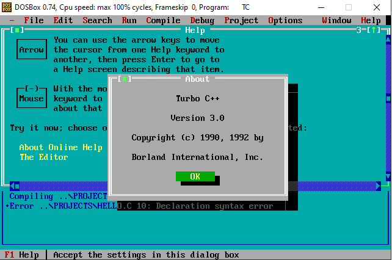
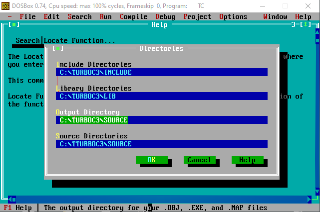

# Turbo C/C++ Teması

Yazılım geliştirmeye 2000 yılından önce başlayan geliştiricilerin görmüş olduğu ve tam bir efsane olan Turbo C/C++ programını baz alarak geliştirdiğim bir tema. Bu tema şu anda bu yazıyı okumuş olduğunuz site de kullanılmaktadır.

## Motivasyon

Küçükken en büyük eğlencem, bilgisayar dergilerini okumak ve onlardan çıkan CD lerdeki demo oyunları oynamaktı. Bir gün dergilerden bir tanesinin yanında ufak bir el kitapçığı buldum **C ile Programlama**. Kitapçık içinde basit bir şekilde C programlama dili anlatılıyordu. Kitapçığı bir çırpıda okudum ve denemek istiyordum. Turbo C adında bir program olduğunu ve bunun ile örnek yapabileceğim yazılıyordu ama program hiç bir yerde yoktu. İnternette dolaşırken buldum. Kendilerini hacker olarak tanıtan bir ekibin hazırladığı notların da olduğu bir zip dosyasını indirdim. İçinde Turbo C de vardı. Önce notları okudum ve sonrasında denemeler yapmaya başladım.

Bir kitapçık sayesinde programlamaya başlamam lise yıllarına denk geliyor. Programlamaya başladıktan sonra da ayrılamadım.

Yazılıma ilk başladığım geliştirme ortamını unutmadığımı göstermek, sade ve biraz nerd işi olan bir tame istedim. Bu istediğim özelliklerde bir şey de bulamadım. En sonunda kendim bir şeyler yapayım dedim ama öyle hazır bir şeyler kullanmak yerine ellerimi biraz kirletmek istedim.

## Zorluklar

En önemli zorluğun daha önceden Turbo C/C++ kullanmış olan kişiler için aynı hissi verebilinir mi kaygısı olduğunu düşünüyorum. Masaüstü olarak geliştirilmiş bir uygulamanın sağladığı deneyim ile bir web sitesinin sağlayacağı deneyim tamamen farklı. Ancak yine de bunu başarabileceğime inandım ve kolları sıvadım.

Geliştirmeye başladığımda ilk aklımda **HTML 5** ve **CSS 3** ile ilerlemek vardı. Ancak daha sonra işin içine **SASS** dahil etmek istedim.

Backend geliştirmesi yapan bir geliştiriciyim. Çok nadir olarak frontend geliştirmesi yaptım. Bu projenin diğer bir zorluğu da tanıdığım frontend geliştirici arkadaşlarımın da onaylayacağı bir yapı kurmaktı.

Bütün geliştirmeyi yaptıktan sonra bu projenin bir şekilde görücüye de çıkması gerekiyordu. Bunun için de daha önce kullandığım **Gulp** otomasyon kütüphanesini de kullanarak **GitHub Actions** sayesinde **GitHub Pages** üzerinde yayına aldım.

Geliştirmelerde güvenlik açıkları veya kod iyileştirmelerinin her zaman olabileceğini biliyorum. Bu açıkları takip etmek için **GitHub CodeQL** ve **SonarCloud** ile sağlamaya çalıştım.

## Tema Özellikleri

Tema sade olsun istemedim. Bazı ek özellikler de eklemek istedim. Geliştirmeye devam ediyorum ama basit olarak yazmak gerekirse temanın özellikleri aşağıdaki gibi.

- Responsive tasarıma sahip,
- 4 renk olarak kullanılabilir,
  - Aqua
  - Blue
  - Black
  - White
- Turbo C'nin çalıştığı 8-bit ortama uygun renk paleti var,
- Tasarıma eklenen elementler
  - Yazı sitilleri
  - Button
  - Textbox
  - Textarea
  - Checkbox
  - Radio Button
  - Selectbox
  - Table
  - Form
  - Dialog
  - Menu (Navigation Bar)
  - Notification Boxes

Temayı kendim için geliştirdim ama herkesin kullanımına [MIT](https://github.com/fatihtatoglu/blog-theme-turboc/blob/master/LICENSE "Projenin MIT Lisansı") lisansı ile açtım. Sizde kullanmak isterseniz temanın [GitHub](https://github.com/fatihtatoglu/blog-theme-turboc "Projenin GitHub Adresi") reposunu ziyaret edebilirsiniz. Eğer beni desteklemek isterseniz, repoyu yıldızlayabilir, demo site üzerinden bulduğunuz bugları issue olarak açabilir ya da yeni özellik isteklerinizi issue olarak iletebilirsiniz.

## Referanslar

1. [CSS Architecture — Part 1 - Normalize CSS or CSS Reset?!](https://elad.medium.com/normalize-css-or-css-reset-9d75175c5d1e "CSS Architecture — Part 1 - Normalize CSS or CSS Reset?!")
2. [normalize.css](https://necolas.github.io/normalize.css/ "normalize.css")
3. [Sass : @function, @mixin, placeholder, @extend](https://dev.to/keinchy/sass--function-mixin-placeholder-extend-18g6 "Sass : @function, @mixin, placeholder, @extend")
