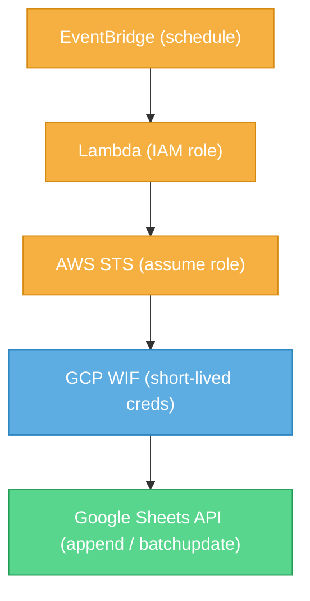

# AWS Lambda ve Google Sheets Bağlantısı

Yakın zamanda bir AI startup firması için bir proje geliştiren bir ekibin içerisinde yer aldım. Startup olmasından kaynaklı bazı şeyleri hızlı yapmak adına bir boilerplate satın aldık ve üstüne işin ihtiyacı olan geliştirmeleri yaptık. Boilerplate'i ihtiyaçlarımıza göre esnettik. Boilerplate bize AWS üzerinde bir startup'ın ihtiyacı olan teknik altyapıyı AWS dahilindeki ürünleri kullanarak sağlıyor. Biz de esnetme işlemi sırasında yine AWS kaynaklarını kullanmayı tercih ettik. Ama boilerplate'te bir raporlama yapısı yoktu ki olmasını da beklememiştik seçim yaparken.

Uzun lafın kısası, AWS kaynaklarındaki verileri Google Sheets üzerine aktararak bir dashboard oluşturma ihtiyacımız oldu. Bu yazıda, AWS üzerindeki verilerimizi nasıl Google Sheets dosyasına taşıdığımızı detaylı şekilde anlatacağım. Karmaşık bir ETL yerine, anahtarsız kimlik federasyonu ile **6 saatte bir** Google Sheets'e akan minimal bir çizgi izledim.

## Özet

En sonda söyleyeceğimi başta paylaşmış olayım: Workload Identity Federation ile AWS ve GCP'yi birbirine bağlıyorum. 6 saatte bir çalışan bir Lambda fonksiyonu ile Google Sheets üzerine veri aktarıyorum. Hem hızlı hem de düşük maliyetli bir çözüm üretmiş oluyorum.

## Mimarinin Özeti (EventBridge -> Lambda -> WIF -> Sheets)

AWS tarafında **EventBridge** tarafından zamanlanarak tetiklenen **Lambda**, kalıcı anahtar kullanmadan GCP'deki **Workload Identity Federation (WIF)** üzerinden kısa ömürlü kimlik alır ve verileri **Google Sheets API**'ye yazar. Aşağıdaki diyagram bu akışı tek bakışta özetliyor.



- **Tetikleyici:** EventBridge `rate(6 hours)` ile Lambda çalışır.
- **Hesaplama:** Lambda, **salt-okur** izinli IAM rolüyle DynamoDB/Cognito'dan okur.
- **Kimlik Federasyonu:** Lambda rolü, GCP'deki **Workload Identity Federation (WIF)** provider'a güvenilir olarak tanıtılmıştır.
- **Yetkilendirme:** Lambda, WIF üzerinden **kısa ömürlü** GCP kimlik belirteci alır ve **Google Sheets API**'ye yetkili istek atar.
- **Yazma:** `run_log` sekmesine erişim/doğrulama kaydı, diğer sekmelere metrikler eklenir.

## Neden Bu Yaklaşım?

- **Anahtarsız ve güvenli:** Workload Identity Federation ile kalıcı GCP anahtarı tutmuyorum; kimlik federasyonu ve yetki devriyle erişim sağlıyorum.
- **Hızlı teslim:** ETL/warehousing kurmak yerine ihtiyaca uygun "hafif" bir çözüm. Sheets, iş ekipleri için yeterli görünürlük sağlıyor.
- **Maliyet/operasyon basitliği:** Serverless (EventBridge -> Lambda) ile zamanlanmış, bakımı kolay ve düşük maliyetli bir akış.

## Önkoşullar

Geliştirmeye başlamadan önce aşağıdaki listeye bir bakın. Bu maddeleri sağlamıyorsanız önce bunları tamamlamanız gerekir; aksi durumda süreçte aksamalar olabilir.

### AWS Gereksinimleri

Bu süreçte AWS tarafında bir Lambda fonksiyonu geliştiriyorum. Bu fonksiyon 6 saatte bir tetiklenen bir iş; DynamoDB ve Cognito'dan verileri alıp Google Sheets'te farklı sayfalara yazar.

Veri aktarımını yapacak fonksiyonu Serverless Framework'ü ile AWS'ye deploy edeceğim.

Bütün bu işlemler için bir adet gerekecek kadar yetkiye sahip kullanıcıya ait AWS erişim bilgisi gerekir. Ek olarak, çoğu AWS işleminde kullanıldığı üzere AWS CLI v2 kurulu olmalıdır.

### Google Cloud Gereksinimleri

Verilerin aktarılacağı hedef Google Cloud. Bu tarafta da birkaç ayar gerekiyor.

Google Cloud Console üzerinde bir servis hesabı açacağız. Sonrasında bu servis hesabı ile WIF kurulumunu tamamlayacağız. Ardından bu erişim bilgilerini kullanarak verilerin Google Sheets üzerine yazılmasını sağlayacağız.

Bu işlemler için Google Cloud Console üzerinde yönetici yetkisine sahip olmak faydalıdır.

### Geliştirme Ortamı (Python)

Ekip yetkinliklerine göre kodlar Python ile yazıldı; ben de örnekleri Python ile aktaracağım.

Bu projede kullandığımız boilerplate'i değil ama benzer yapıda, benim geliştirmiş olacağım bir boilerplate'i de ilerleyen zamanda paylaşacağım.

## Kurulum Adımları

Veri aktarımının en önemli ve olmazsa olmaz noktası, AWS'in ve Google Cloud'un birbiriyle konuşabilmesi. Öncelikle bunu sağlayacağız.

Hangi adımın daha öncelikli olduğu kararını siz verebilirsiniz; ben kendi izlediğim adım sırasıyla ilerliyorum.

### Lambda Rolü ve Zamanlayıcı

Önce veri aktarımını yapacak Lambda fonksiyonu oluşturulur. Servisi oluştururken normalde genel bir rol kullanılır; ancak Google tarafını da kullanacağımız için bu Lambda fonksiyonu için özelleşmiş bir rol oluşturuyoruz.

```yml
...
resources:
  Resources:
    DashboardCalculatorRole:
      Type: AWS::IAM::Role
      Properties:
        RoleName: ${self:custom.stage}-dashcalc-role
        AssumeRolePolicyDocument:
          Version: "2012-10-17"
          Statement:
            - Effect: Allow
              Principal:
                Service:
                  - lambda.amazonaws.com
              Action:
                - sts:AssumeRole
        ManagedPolicyArns:
          - arn:aws:iam::aws:policy/service-role/AWSLambdaBasicExecutionRole
          - arn:aws:iam::aws:policy/AmazonCognitoReadOnly
        Policies:
          - PolicyName: DashboardCalculatorPlatformRead
            PolicyDocument:
              Version: "2012-10-17"
              Statement:
                - Effect: Allow
                  Action:
                    - dynamodb:GetItem
                    - dynamodb:Query
                    - dynamodb:Scan
                  Resource:
                    - ${self:custom.platformTable.arn.${self:custom.stage}}
                    - ${self:custom.aiTable.arn.${self:custom.stage}}
                    - !Join
                      - /
                      - - ${self:custom.platformTable.arn.${self:custom.stage}}
                        - index/*
                    - !Join
                      - /
                      - - ${self:custom.aiTable.arn.${self:custom.stage}}
                        - index/*
```


Bu rol, projedeki ihtiyaçları gözeterek Cognito ve DynamoDB kaynaklarına salt okuma şeklinde erişir.

```yml
...
  dashboard_calculator:
    handler: src/dashboard_cron.handle
    name: ${self:custom.stackName}-dashboard-calculator
    memorySize: 512
    timeout: 180
    reservedConcurrency: 1
    maximumRetryAttempts: 0
    role:
      Fn::GetAtt:
        - DashboardCalculatorRole
        - Arn
    events:
      - schedule:
          rate: rate(6 hours)
          enabled: true
```

Genel bir rol yerine özel bir rol kullandığımız için Lambda tanımını yaparken de bu rol fonksiyon tanımında belirtilir.

Bu tanımları yaptıktan sonra kendi şablon kodumu `src/dashboard_cron.py` dosyasına ekliyorum.

```python
from typing import Any

from lib import utils_time as t
from lib.utils import get_logger


logger = get_logger()


def handle(event: dict[str, Any], context: Any) -> dict[str, Any]:
    t_start = t.utc_now()

    id = event.get("id", "")
    source = event.get("source", "")
    time = event.get("time", t.to_iso(t.utc_now()))

    params: dict[str, str] = {"id": id, "source": source, "time": time}

    logger.info(f"🚀 Let's start!!! {params}")

    result = execute()

    t_end = t.utc_now()
    t_elapsed = t_end - t_start
    logger.info(f"⏱️  Elapsed Duration: {t_elapsed.total_seconds()}")

    return result


def execute() -> dict[str, Any]:
    return {}
```

`requirements.txt` dosyası da şu şekilde oluyor.

```text
boto3
python-dotenv
```

Kodları da ekledikten sonra fonksiyon deploy edildi.

```bash
serverless deploy --stage production --force
```

Bu deployment başarıyla tamamlandıktan sonra aşağıdaki komutu çalıştırarak oluşturulan rolün ARN değerini bulun. Bu değer birazdan kullanılacak.

```shell
aws iam list-roles --output json | jq "{Roles:[.Roles[] | { RoleName: .RoleName, Arn: .Arn }]}" | jq -r ".Roles[] | select(.RoleName | endswith(\"dashcalc-role\"))"
```

Yukarıdaki komut Windows ortamında çalışır. macOS ve Linux için aşağıdaki komutu kullanın:

```bash
aws iam list-roles --output json | jq '{Roles:[.Roles[] | { RoleName: .RoleName, Arn: .Arn }]}' | jq -r '.Roles[] | select(.RoleName | endswith("dashcalc-role"))'
```

### Workload Identity Federation (GCP)

AWS tarafındaki adımı bitirdikten sonra, şimdi Google Cloud tarafındaki servis ayarlamaları yapılacak.

Bu adımda ilk önceliğimiz yeni bir proje yaratmak. Eğer var olan projenizi kullanacaksanız bu adımı geçebilirsiniz.

#### Proje Oluşturma

Proje listesini açıyoruz ve `New Project` butonuna tıklıyoruz. Açılan sayfada projemize bir isim veriyoruz. Google bizim için projemize tekil bir ID oluşturuyor. Bunu şu anda değiştirebilmek için `Edit` bağlantısına tıklamak yeterli olacaktır; sonrasında değiştirme şansımız olmayacak.

İşlem bittiğinde proje ID değerini bir yere not ediyoruz.

#### Service Account Oluşturma

Sol menüden `IAM & Admin` -> `Service Accounts` yolunu izleyin veya arama alanına `Service Accounts` yazarak ilgili sayfayı açın. Bu sayfa, seçtiğiniz projelerdeki servis hesaplarını listeler.

`Create service account` butonuna tıklayarak yeni bir servis hesabı oluşturuyoruz. Bu işlem sırasında servis adı veriyoruz ve Google tekil bir service account ID üretiyor. Bunun yanında `@<project_id>.iam.gserviceaccount.com` uzantılı bir e-posta da üretiyor. Bu e-postaya ihtiyacımız olacak; not alın.

Bilgileri girdikten sonra `Create and Continue` butonuna tıklıyoruz. Permission kısmında:

- Editor
- Workload Identity User

seçeneklerini işaretliyor ve `Continue` diyoruz. Son adımı da `Done` ile tamamlıyoruz.

#### Workload Identity Federation

Çoğu bulut sağlayıcısında olan ve erişim anahtarlarını ortadan kaldırarak işlemlerin anlık yetkilendirmelerle yapılmasını sağlayan bir servis yapısıdır. AWS ile olan bağlantımızda bu yapıyı kullanacağız.

Öncelikle bir Workload Identity Pool oluşturmak gerekiyor.

Sol menüden `IAM & Admin` -> `Workload Identity Federation` bağlantısına tıklayarak ya da arama çubuğuna `Workload Identity Federation` yazarak ilgili sayfayı açın.

Karşınıza `Get Started` butonu çıkabilir; tıklayın. Eğer çıkmazsa `Add Provider` butonundan `New Pool` seçeneğini seçin.

Açılan ekranda pool için bir isim belirleyin.

`Add a provider to pool` listesinden `AWS`'yi seçin. Provider için bir isim girin ve ardından AWS Account ID değerini girin. Eğer bilmiyorsanız bu değeri bulmak için aşağıdaki komutu çalıştırın:

```bash
aws sts get-caller-identity --query Account --output text
```

Bu değeri girdikten sonra `Continue` ile `Configure Provider` sekmesine geçiyoruz. Burada ek bir şey yapmanıza gerek yok; sadece emin olmak için `Edit Mapping` bağlantısına tıklayarak detayları açın.

Karşınıza şöyle bir tablo gelmeli:

|Google|AWS|
|---|---|
|attribute.aws_role|assertion.arn.contains('assumed-role') ? assertion.arn.extract('{account_arn}assumed-role/') + 'assumed-role/' + assertion.arn.extract('assumed-role/{role_name}/') : assertion.arn|
|google.subject|assertion.arn|

#### Service Account Workload Identity Pools Tanımı

Google Cloud tarafında elimizde bir servis hesabı ve bir Workload Identity Pool tanımı var. Şimdi bunları bağlamamız gerekiyor.

Tanımladığımız pool'un detayına giriyoruz ve `Grant Access` bağlantısına tıklıyoruz. Açılan sayfadan `Grant access using service account impersonation` seçeneğini seçiyoruz.

Servis hesabı listesinden tanımladığımız servis hesabını seçiyoruz. `Select principals` listesinden `aws_role` değerini seçiyor ve yanındaki alana AWS'de tanımladığımız rolün ARN değerini yazıyoruz.

Artık AWS ve Google Cloud arasındaki köprü kurulmuş oldu.

#### Erişim Bilgileri

Köprü kurulduktan sonra tekrar AWS'ye dönüp gereken tanımları yapmam ve bağlantı doğrulamasını yapmam gerekiyor.


Bunun için Workload Identity Pool detayında `Connected service account` sekmesini göreceksiniz. Bu sekmeye tıklayın ve tanımladığınız servis hesabının yanındaki `Client library config` dosyasını indirin.

```json
{
  "universe_domain": "googleapis.com",
  "type": "external_account",
  "audience": "//iam.googleapis.com/projects/<project-id>/locations/global/workloadIdentityPools/aws-gcp-pool/providers/....",
  "subject_token_type": "urn:ietf:params:aws:token-type:aws4_request",
  "service_account_impersonation_url": "https://iamcredentials.googleapis.com/v1/projects/-/serviceAccounts/<service-account-name>@<project-name>.iam.gserviceaccount.com:generateAccessToken",
  "token_url": "https://sts.googleapis.com/v1/token",
  "credential_source": {
    "environment_id": "aws1",
    "region_url": "http://169.254.169.254/latest/meta-data/placement/availability-zone",
    "url": "http://169.254.169.254/latest/meta-data/iam/security-credentials",
    "regional_cred_verification_url": "https://sts.{region}.amazonaws.com?Action=GetCallerIdentity&Version=2011-06-15"
  }
}
```

Yukarıdaki gibi bir JSON olmalı.

### Sheets API Yetkilendirme

Tanımları yaptıktan sonra, hadi son bağlantı adımıyla devam edelim.

Benim senaryomda AWS'deki verilerin sabit bir Google Sheets dosyasına aktarılması planlandı. Bu sebeple sadece servis hesabı e-postasını ilgili Google Sheets içinde **Editör** olarak yetkilendirmem, birebir bir bağlantı kurmama olanak sağladı.

Burada sadece erişmek istediğimiz dokümana yetki vermemiz önemli. Size de bu güvenlik noktasını düşünerek işlem yapmanızı öneriyorum. Ek olarak başka servislere de ihtiyacınız varsa bunları da eklemeyi unutmayın.

### Lambda'dan Sheets'e Yazma

Lambda fonksiyonunu aslında ilk tanımlamıştım; oradaki amacım özel rolün yayına geçmesiydi.

Şimdi ise kalan son bağlantı adımını yapacağım.

```python
import base64
import json
import os
from typing import Any

from lib import utils_time as t
from lib.config import get_env_var
from lib.utils import get_logger

from google.auth import aws
from google.auth.transport.requests import AuthorizedSession, Request

logger = get_logger()

GOOGLE_EXTERNAL_ACCOUNT_ENV = "GOOGLE_EXTERNAL_ACCOUNT_JSON"
GSHEET_ID_ENV = "GSHEET_ID"
GSHEET_RUNS_TAB_ENV = "GSHEET_RUNS_TAB"


def handle(event: dict[str, Any], context: Any) -> dict[str, Any]:
    t_start = t.utc_now()

    id_ = event.get("id", "")
    source = event.get("source", "")
    event_time = event.get("time", t.to_iso(t.utc_now()))

    params: dict[str, str] = {"id": id_, "source": source, "time": event_time}
    logger.info(f"🚀 Let's start!!! {params}")

    result = execute()

    t_end = t.utc_now()
    t_elapsed = t_end - t_start
    logger.info(f"⏱️  Elapsed Duration: {t_elapsed.total_seconds()}")

    return result


def execute() -> dict[str, Any]:
    try:
        credentials = _load_google_credentials()
        credentials.refresh(Request())
        session = AuthorizedSession(credentials)
    except Exception as exc:
        logger.exception("Failed to authenticate with Google Sheets")
        return {"status": "error", "message": f"Google auth failed: {exc}"}

    spreadsheet_id = os.getenv(GSHEET_ID_ENV, "").strip()
    if not spreadsheet_id:
        return {"status": "error", "message": f"Missing env var {GSHEET_ID_ENV}"}

    sheet_name = os.getenv(GSHEET_RUNS_TAB_ENV, "run_log").strip() or "run_log"

    try:
        _ensure_sheet_exists(session, spreadsheet_id, sheet_name)
        note = f"{t.to_iso(t.utc_now())} - access verified"
        _append_col_a(session, spreadsheet_id, sheet_name, note)
        logger.info("✅ Accessing Google Sheets and writing was successful.")
        return {"status": "ok"}
    except Exception as exc:
        logger.exception("Google Sheets write failed")
        return {"status": "error", "message": f"Sheets write failed: {exc}"}


def _load_google_credentials() -> aws.Credentials:
    raw_config = get_env_var(GOOGLE_EXTERNAL_ACCOUNT_ENV)
    config_str = raw_config.strip()
    if not config_str:
        raise ValueError(
            f"{GOOGLE_EXTERNAL_ACCOUNT_ENV} is set but empty; cannot build Google credentials"
        )

    if len(config_str) >= 2 and config_str[0] in {"'", '"'} and config_str[-1] == config_str[0]:
        config_str = config_str[1:-1].strip()

    if not config_str.startswith("{"):
        try:
            config_str = base64.b64decode(config_str).decode("utf-8")
        except Exception as exc:
            raise ValueError(
                "Google external account config must be JSON or base64-encoded JSON"
            ) from exc

    try:
        config = json.loads(config_str)
    except json.JSONDecodeError as exc:
        raise ValueError("Invalid JSON in Google external account config") from exc

    return aws.Credentials.from_info(
        config, scopes=["https://www.googleapis.com/auth/spreadsheets"]
    )


def _ensure_sheet_exists(session: AuthorizedSession, sheet_id: str, sheet_name: str) -> int:
    metadata_url = (
        f"https://sheets.googleapis.com/v4/spreadsheets/{sheet_id}"
        "?fields=sheets(properties(sheetId,title))"
    )
    resp = session.get(metadata_url)
    resp.raise_for_status()
    sheets = resp.json().get("sheets", []) or []
    for sheet in sheets:
        props = sheet.get("properties", {})
        if props.get("title") == sheet_name:
            return int(props.get("sheetId", 0))

    batch_update_url = f"https://sheets.googleapis.com/v4/spreadsheets/{sheet_id}:batchUpdate"
    body = {"requests": [{"addSheet": {"properties": {"title": sheet_name}}}]}
    add_resp = session.post(batch_update_url, json=body)
    add_resp.raise_for_status()
    replies = add_resp.json().get("replies", [])
    props = (replies[0] or {}).get("addSheet", {}).get("properties", {}) if replies else {}
    sheet_id_value = props.get("sheetId")
    if sheet_id_value is None:
        raise RuntimeError(f"Failed to retrieve sheetId for sheet {sheet_name}")
    return int(sheet_id_value)


def _append_col_a(session: AuthorizedSession, spreadsheet_id: str, sheet_name: str, value: str) -> None:
    rng = f"{sheet_name}!A:A"
    url = (
        f"https://sheets.googleapis.com/v4/spreadsheets/{spreadsheet_id}"
        f"/values/{rng}:append?valueInputOption=RAW&insertDataOption=INSERT_ROWS"
    )
    body = {"values": [[value]]}
    resp = session.post(url, json=body)
    resp.raise_for_status()
```

`requirements.txt` dosyası da şu şekilde oluyor.

```text
boto3
python-dotenv
google-auth
requests
```

Yukarıdaki kodu Lambda fonksiyonu içerisine ekleyip deploy ettiğinizde bağlantı tamamlanmış olur.

Artık Google Sheets içine istediğiniz veriyi taşıyabilir ve sonrasında dilediğiniz gibi bir dashboard kurabilirsiniz.

## Güvenlik Önerileri (Least Privilege, Secrets, IAM)

Yapılan entegrasyonun güvenlik kısmını da biraz detaylandırmak faydalı olacaktır. Amacım, WIF ve Lambda yapısını neden seçtiğimi güvenlik perspektifinden anlatmak.

Öncelikle bireysel veya kurumsal bir GCP yapınız olmasından bağımsız olarak **Workload Identity Federation** kullanmanızı öneriyorum. Bu sayede kalıcı erişim anahtarı riski ortadan kalkar ve daha güvenli bir entegrasyon sağlanır.

Bunun yanında Lambda için özel bir rol tanımlamak, sorun anında bağlantının kolaylıkla incelenmesini sağlar ve diğer servislerin erişimine gereksiz izin vermemiş olursunuz. Ek olarak bu rolü yalnızca gereken yetkilerle tanımlamak **least privilege** prensibini destekler. Admin kullanıcı yerine, yalnızca gerekli izinleri olan bir **IAM kullanıcı/rol** tercih edin; Lambda'nın rolü zaten okuma amaçlıdır.

Son olarak erişim için kullandığımız JSON yapılandırmalarını **Secret Manager** üzerinde saklamak ek güvenlik sağlar.

## Sorun Giderme (Limitler, Bağımlılıklar)

Bu bağlantıyı yaparken karşılaştığım bazı sorunlar ve çözümleri:

### Rol İsim Uzunluğu

AWS'de yol tanımı yaparken projenin ortamı ve ismini kullanarak uzun bir rol adı yazıyordum. Bu kez limite takıldım.

AWS'de bir rolün adı en fazla 64 karakter olabilir. Benim ilk tanımladığım isim `arn:aws:iam::<aws-account-id>:role/production-projenin-adi-backend-servisad-dashboard-calculator-role` şeklindeydi. Bu limite takılınca `arn:aws:iam::<aws-account-id>:role/production-projenin-adi-backend-servisad-dash-calc-role` olarak kısalttım.

### GCP Key Uzunluğu

İlk sorunu çözdükten sonra bu kez GCP tarafında bir limite takıldım. Bu limit, Workload Identity Pool tanımını yaparken provider mapping üzerindeki `google.subject` anahtarının en fazla 127 karakter kabul etmesiydi.

Bunu çözmek için rol ismini `arn:aws:iam::<aws-account-id>:role/production-dashcalc-role` yaparak biraz daha kısalttım.

### `requests` Kütüphanesi

Lambda üzerinde geliştirmeleri tamamlayıp çalıştırdım. CloudWatch'ta hata: `requests` kütüphanesi eksik. `google-auth` kütüphanesinin `requests` ile bağı olduğunu gözden kaçırmışım; bu yüzden hata aldım.

`requirements.txt` içine ekledikten sonra sorun ortadan kalktı.

## Kapanış Sözü

Çoğu zaman çok ilgilenmediğim (veya daha çok SQL tabanlı veritabanlarıyla projeyi geçiştirdiğim) bir ihtiyacı, basit ve uygun bir çözümle ele almak istedim. Günün sonunda projenin iş takibi için gereken metriklerin olduğu bir dashboard yapmak hem startup hem de benim için faydalı oldu.

Projeye başlarken eksik olduğunu düşündüğüm AWS ve Python bilgime rağmen şu ana kadar ihtiyaçları karşılayabildim. Bu yüzden mutluyum. Umarım size de yararlı olur.

Eğer siz de katkı sağlamak isterseniz, benzer bir ihtiyacı nasıl karşılayacağınızı paylaşabilir, benzer bir kurulumu yaptıysanız tecrübelerinizi yorumlarda paylaşabilir, bu yazıyı okumasını istediğiniz kişilere iletebilir veya beğeni ve yorumlarınızı bırakabilirsiniz.

## Kaynaklar ve Ek Okumalar

- [Workload Identity Federation](https://cloud.google.com/iam/docs/workload-identity-federation)
- [Python Quickstart](https://developers.google.com/workspace/sheets/api/quickstart/python)
- [Invoke a Lambda function on a schedule](https://docs.aws.amazon.com/lambda/latest/dg/with-eventbridge-scheduler.html)
